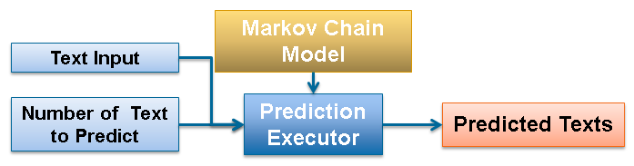

### Overview

Commonly, prediction is tightly associated with prevention. However prediction today is about the future!

The impact of deriving applications out of words modelled statistically has improved the living quality of various walks of life.

As examples,

1. SwiftKey Keyboard; the main motivator of this project is able to predict the next words as user types. For individuals who are always on the go; any composition task on mobile is a breeze!

2. Text-To-Speech Synthesizer; assists user in speech construction even challenged by disability. This helps in breaking down physical communication boundaries. (E.g. Stephen Hawkin)

--- .class #id 

### How It Works ?

`Markov Chain Model` is the main driver of the application. It represents each word as state with trasitional probabilities. As example below, word "B" has 30% chance of transition to word "A".

   | A | B |
---|---|---|
 A | 0.6 | 0.4 |
 B | 0.3 | 0.7 |
     
 
`Add-1 Smoothing` is applied to distribute some of the high probability mass to words that have zero probaility mass. The objective is to have a fairer prediction model.

`Shiny Application` is used to embed the `model` described above; along with a `Prediction Executor` and `User Interface`.

--- .class #id 

### Too Easy To Use !

--- .class #id 

### What's Next ?
